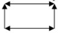

# MPI lab 1

---

## Problem statement

The main task of this laboratory work is the development and
research of a parallel program that searches for a numerical solution for
the transfer equation:

$ ∂u(t,x)/∂t + a∙∂u(t,x)/∂x = f(t,x), 0≤t≤T, 0≤x≤X $

$ u(0,x) = φ(x), 0≤x≤X $

$ u(t,0) = ψ(t), 0≤t≤T $

To solve the problem, a uniform grid with steps τ in time and h in
coordinate is used. The function $u(t,x) $ is considered at the points $t=kτ, x=mh, 0≤k≤K, 0≤m≤M, T=Kτ,
X=Mh $.

The difference scheme is written as follows:

$ (u_{m−1}^{k+1} − u_{m−1}^{k} + u_m^{k+1} − u_m^k)/2 τ + c(u_m^{k+1} − u_{m−1}^{k+1} + u_{m}^{k} − u_{m−1}^{k})/2h = f_{m-1/2}^{k+1/2},k=0, ... ,K− 1,m=0,. .. ,M $




## Build and run

Build
```
git clone https://github.com/Dmitrryy/MIPT_prog
cd MIPT_prog/parprog/Lab1
mkdir build | cd build
cmake ..
cmake --build .
```
Run
```
mpiexec -np <nProc> .\lab1 [<out file name>(optional)]
```
Drawing a graph based on the received data
```
py ..\process.py <name of file with results>
```

## Theoretical evaluation of efficiency

мне лень

## Security questions

1. Acceleration and efficiency of parallel algorithms.
2. Amdahl's Law.
3. Properties of the data transmission channel. Latency.
4. Types of point-to-point exchanges: synchronous, asynchronous. Data buffering.
5. Load balancing: static and dynamic.
6. Geometric parallelism.
7. Pipeline parallelism.

